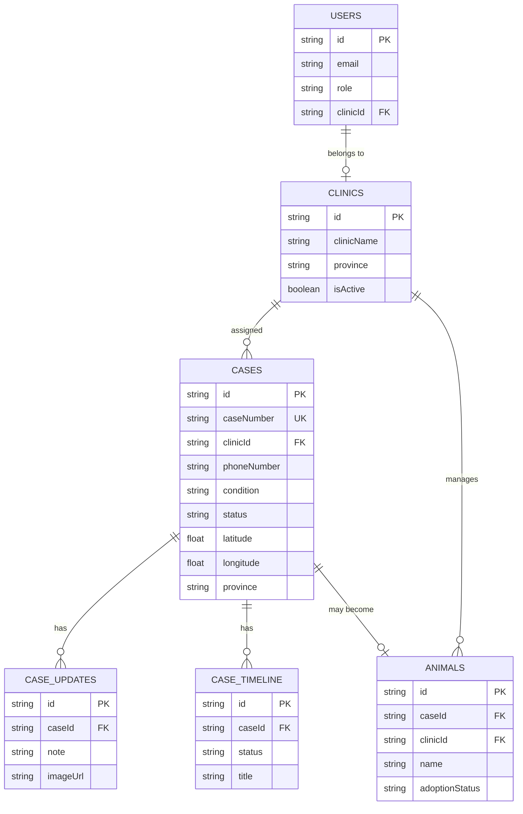

# 6 & 7. Firestore Database Design & ER Diagram

## 6.1 Collections Overview

| Collection | Purpose | Key Fields |
|------------|---------|------------|
| `users` | Clinic staff accounts | email, role, clinicId |
| `clinics` | Veterinary clinics | clinicName, province |
| `cases` | Rescue cases | caseNumber, clinicId, status, GPS |
| `caseUpdates` | Treatment progress | caseId, note, imageUrl |
| `caseTimeline` | Status history | caseId, status, title |
| `animals` | Adoption listings | caseId, adoptionStatus |
| `counters` | Case number sequence | year, sequence |

## 6.2 Collection Schemas

### users
```typescript
{
  id: string;           // Firebase Auth UID
  email: string;
  role: "clinic" | "admin";
  clinicId?: string;    // FK → clinics
  displayName?: string;
  createdAt: Timestamp;
  updatedAt: Timestamp;
}
```

### clinics
```typescript
{
  id: string;
  clinicName: string;
  province: string;     // จังหวัด (routing key)
  address?: string;
  phone?: string;
  email?: string;
  isActive: boolean;
  createdAt: Timestamp;
  updatedAt: Timestamp;
}
```

### cases
```typescript
{
  id: string;
  caseNumber: string;   // CASE-2026-000001 (unique)
  clinicId: string | null;
  phoneNumber: string;
  condition: AnimalCondition;
  description: string;
  imageUrl: string;
  latitude: number;
  longitude: number;
  province: string;
  status: CaseStatus;
  createdAt: Timestamp;
  updatedAt: Timestamp;
  acceptedAt?: Timestamp;
  closedAt?: Timestamp;
}
```

### caseUpdates
```typescript
{
  id: string;
  caseId: string;       // FK → cases
  imageUrl?: string;
  note: string;
  createdAt: Timestamp;
  createdBy?: string;   // clinic user UID
}
```

### caseTimeline
```typescript
{
  id: string;
  caseId: string;
  status: CaseStatus;
  title: string;
  description?: string;
  createdAt: Timestamp;
  createdBy?: string;
}
```

### animals
```typescript
{
  id: string;
  caseId: string;       // FK → cases
  clinicId: string;     // FK → clinics
  name: string;
  gender: "MALE" | "FEMALE" | "UNKNOWN";
  estimatedAge: string;
  weight?: number;
  description: string;
  personality?: string;
  vaccinationStatus: boolean;
  sterilizationStatus: boolean;
  imageUrls: string[];
  adoptionStatus: "AVAILABLE" | "PENDING" | "ADOPTED";
  createdAt: Timestamp;
  updatedAt: Timestamp;
}
```

### counters
```typescript
{
  id: string;           // e.g. "cases-2026"
  sequence: number;
  updatedAt: Timestamp;
}
```

## 6.3 Indexes

See `firestore.indexes.json` for composite indexes:
- `cases`: clinicId + status + createdAt
- `cases`: caseNumber
- `cases`: province + status + createdAt
- `caseUpdates`: caseId + createdAt
- `caseTimeline`: caseId + createdAt
- `animals`: adoptionStatus + createdAt

## 7. ER Diagram {#er-diagram}



## 6.4 Province-Based Routing

```
Reporter submits case (province = "สระบุรี")
    → Query clinics WHERE province = "สระบุรี" AND isActive = true
    → Assign clinicId to case
    → Clinic sees case in NEW queue
```
