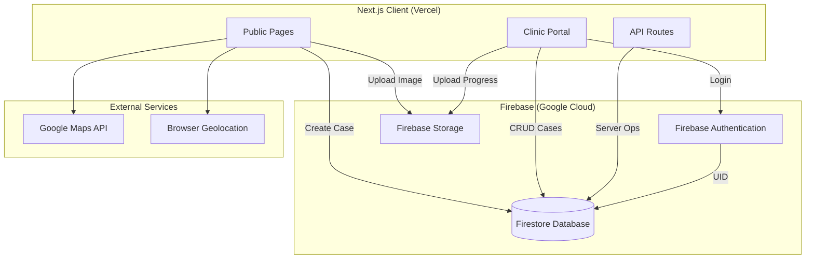

# 9. Firebase Architecture

## 9.1 Architecture Diagram



## 9.2 Service Mapping

| Feature | Firebase Service | Notes |
|---------|------------------|-------|
| Clinic Login | Authentication | Email + Google provider |
| Case Data | Firestore | Real-time capable |
| Images | Storage | cases/, case-updates/, animals/ |
| Case Number | Firestore Transaction | counters collection |
| Security | Firestore Rules + Storage Rules | Role-based |

## 9.3 Authentication Flow

```
Clinic Staff
  → Firebase Auth (email/google)
  → UID lookup in users collection
  → Verify role = "clinic"
  → Load clinicId
  → Access clinic-scoped data
```

Reporter: **No Firebase Auth** — cases created anonymously via public API/form.

## 9.4 Storage Structure

```
gs://{bucket}/
├── cases/{caseId}/{timestamp}.jpg
├── case-updates/{caseId}/{timestamp}.jpg
└── animals/{animalId}/{timestamp}.jpg
```

## 9.5 Environment Variables

```env
NEXT_PUBLIC_FIREBASE_API_KEY=
NEXT_PUBLIC_FIREBASE_AUTH_DOMAIN=
NEXT_PUBLIC_FIREBASE_PROJECT_ID=
NEXT_PUBLIC_FIREBASE_STORAGE_BUCKET=
NEXT_PUBLIC_FIREBASE_MESSAGING_SENDER_ID=
NEXT_PUBLIC_FIREBASE_APP_ID=
NEXT_PUBLIC_GOOGLE_MAPS_API_KEY=
NEXT_PUBLIC_APP_URL=
```

## 9.6 Deployment

| Component | Platform |
|-----------|----------|
| Next.js App | Vercel |
| Firestore Rules | `firebase deploy --only firestore:rules` |
| Storage Rules | `firebase deploy --only storage` |
| Indexes | `firebase deploy --only firestore:indexes` |

## 9.7 Recommended Production Additions

- Firebase Admin SDK in API routes for secure case number generation
- Cloud Functions for counter increment (avoid client-side counter writes)
- Firebase App Check for abuse prevention
